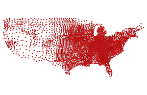
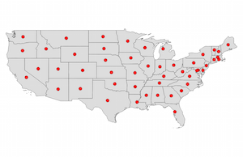

# The Travelling Santa Problem

How many households in the continental United States does Santa need to visit on Christmas, and what's the optimal route for him and his reindeer to hit each on as quickly as possible?

# Overview
There are 3,108 counties in the continental United States, and Santa has to visit each one of them, seeing as [92 percent of Americans](http://www.pewresearch.org/fact-tank/2015/12/21/5-facts-about-christmas-in-america/) celebrate Christmas. That divides this problem into two parts:

1. Assuming Santa chiefly delivers to children age 16 and under, how many households--houses, apartments and other residences--does he have to visit in each county to make sure everyone gets their presents? Using a combination of Census tables and reams of microdata from [IPUMS](https://www.ipums.org/), one can produce confident estimates for those figures.

2. What is the optimal route through those 3,108 counties so that Santa wastes as little time as possible in transit? This is known as the ["Travelling Salesman Problem"](https://en.wikipedia.org/wiki/Travelling_salesman_problem) and has occupied mathematicians, computer scientists and other researchers for decades. A variety of solutions exist with varying levels of accuracy, complexity and abuse to your poor Macbook's processor.

**And finally:** How does the answer to 1) affect the answer to 2) if Santa wants to optimize delivery time? Should he prioritize high-population counties? If so, how far out of his way should he go?

Here's how we went about figuring that out. The code in this repository is divided between Node.js for processing files and R for the statistical heavy lifting. While we will document every step taken to produce the data, many of the results of the early steps are including in the repo so that you can skip straight to calculating the route. So all the steps under "Setting Up Shop" are optional. You're welcome to rerun the code to check our work or just log a little practice, but it isn't necessary.

# Setting Up Shop

To regenerate the geography data that lives in `geography/data`, you just need a few Node dependencies. Well, and Node itself, of course.

	npm install 			# D3 and a few other libraries we need to compute centroids
	npm install -g mapshaper 	# neatly converts SHP files to GeoJSON or TopoJSON formats from the command line

The maps come from the Census Bureau's [Cartographic Boundary Shapefiles](https://www.census.gov/geo/maps-data/data/tiger-cart-boundary.html), which we downloaded for both states and counties but didn't add to the repository to avoid extra baggage. To follow our steps, just move to the `geography/shp` directory and pull these two reasonably small files. But first, let's removing the pre-generated files since we're making them again

	cd geography/data
	rm *
	cd ../shp
	wget http://www2.census.gov/geo/tiger/GENZ2015/shp/cb_2015_us_county_5m.zip
	wget http://www2.census.gov/geo/tiger/GENZ2015/shp/cb_2015_us_state_5m.zip
	unzip cb_2015_us_county_5m.zip
	unzip cb_2015_us_state_5m.zip

This will unzip a bunch of files since [Esri's Shapefile](https://en.wikipedia.org/wiki/Shapefile) format is divided into several parts. If you want to view what the raw maps look like, [QGIS](http://www.qgis.org/en/site/forusers/download.html) is a free program that can open and display the `.shp` files. But you don't have to, because we're only using code that is executable from the command line. The ensures that the process can be fully documented and adheres to the spirit of [Bostock's Law](https://bost.ocks.org/mike/make/). It's files all the way down.

The next step is to convert those files into individual JSON documents that contain each state and county's geographic coordinates and accompanying data. There are a variety of ways to do this, but if you installed `mapshaper` globally with the `-g` flag, as specified above, you can easily do this already.

First, we're going to use `mapshaper` to modify these Shapefiles to exclude Alaska, Hawaii and U.S. territories--not because we believe their children to be poorly behaved, but because the Travelling Salesman Problem is most relevant here to the continuous 48 states and Washington, D.C. (While we could just ignore these regions, striking them from the map makes it display better.) Fortunately, `mapshaper` accepts a JavaScript string as an argument, which we can use to filter the locations down to those with a [FIPS code](https://www.census.gov/geo/reference/ansi_statetables.html) between "01" and "56", which run from Alabama to Wyoming and include D.C. but no other non-states. We just have to skip "02" (Alaska) and "15" (Hawaii).

	mapshaper cb_2015_us_county_5m.shp -filter 'parseInt(STATEFP) <= 56 && STATEFP != "02" && STATEFP != "15"' -o format=shapefile counties.shp
	# Output should say "[filter] Retained 3,108 of 3,233 features"

	mapshaper cb_2015_us_state_5m.shp -filter 'parseInt(STATEFP) <= 56 && STATEFP != "02" && STATEFP != "15"' -o format=shapefile states.shp
	# Output should say [filter] Retained 49 of 56 features

Now we can convert those files to [GeoJSON](http://geojson.org/), a JSON format for geographies. The `mapshaper` tool conveniently includes the metadata from the original Shapefile for each state.

	mapshaper states.shp -o format=geojson ../data/states.json
	mapshaper counties.shp -o format=geojson ../data/counties.json

As always, Mike Bostock has a [cogent rundown on all the contemporary methods](https://medium.com/@mbostock/command-line-cartography-part-1-897aa8f8ca2c#.8icwko3uz) for converting SHP files to lightweight, browser-ready TopoJSON. Since our goal here is to extra information from the files, not to make them production ready, we can skip a few steps. 

If we were just interested in making a map to render in the browser, for example, we would probably take this opportunity to choose a map projection and convert the raw longitude and latitude values to the x and y coordinates we need to display geography on the screen. There are a multitude of [projections](https://github.com/d3/d3-geo-projection#projections) available from Bostock's [d3-geo-projection](https://github.com/d3/d3-geo-projection) module. (Otherwise, one has to run those trig-heavy calculations on the client each time someone loads the map.) In this case, however, we are going to need to calculate the distance between each county as accurately as possible in order to optimize Santa's route. The safest way to do this is to calculate the "great-circle distance" between two lat/long pairs--that is, the distance between two points that accounts for the fact that the earth is [(almost)](https://en.wikipedia.org/wiki/Earth_ellipsoid) round. The algorithm to compute this distance comes in a few main flavors, the most popular of which is probably the [Haversine Formula](https://en.wikipedia.org/wiki/Haversine_formula). Almost every robust programming language has a library to handle this instead of forcing you to revisit arctangents.

We need to compute the central point of each county in order to draw a route between them. Mosey over to the [scripts/](scripts/) directory and you'll see a Node file called `get_centroids.js`. Running this file will read the two GeoJSON files we just created and use D3 to calculate the center point, or "centroid." It will also match the FIPS codes to the Census Bureau's [most recent definitions](https://www.census.gov/geo/reference/codes/cou.html), included here in the root [data](data/) directory, so that we have reliable information for each county. (To wit: Even though that data is mostly baked into the Shapefiles, one can never be too careful in checking that the erstwhile Shannon County, SD has been correctly rebranded as [Oglala Lakota](https://en.wikipedia.org/wiki/Oglala_Lakota_County,_South_Dakota).)

	cd ../../scripts
	node get_centroids.js

This script generates both CSV and JSON versions of our centroids. Loading the original SHP files into QGIS and importing the CSV first centroids confirms that this worked!

  

Okay, now we have the files in the [geography/data](geography/data) directory -- `county_coordinates.csv` and `state_coordinates.csv`--to take a first pass at the Travelling Santa Problem. We'll mostly be dealing with counties, but it's nice to have states for sanity checks.

