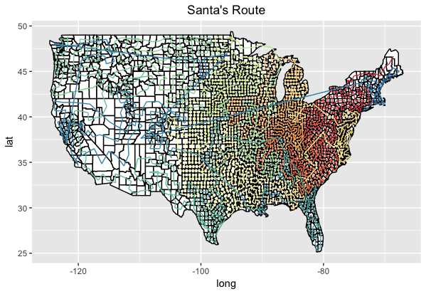

# Calculating the Optimal Route

## The Traveling Salesman Problem

If a traveling salesman has to visit a certain number of cities across a region and wants to minimize the total distance she has to travel to reach them all, what is the optimal route she should take? This is such a famous problem in mathematics that there are any number of papers and tutorials out there that offer solutions in a variety of methods.

Our task is to compute the *pro bono* salesman Santa Claus' route to each of the 3,108 counties in the continental United States, beginning in [Aroostook County, Maine](https://en.wikipedia.org/wiki/Aroostook_County,_Maine), the northeastern-most county in the U.S--and ending in San Diego, the southwestern-most county. For what it's worth, the [number of possible solutions](http://math.stackexchange.com/questions/725396/how-many-routes-possible-in-the-traveling-salesman-problem-with-n-cities-and) is `(n-1)!/2`, which, according to Mathematica--the only program that seems willing to entertain the idea of taking a factorial of 3,108--is 1.568 * 10^9503. *We're definitely not going to try all of them.*

## Getting to work

We're going to be using [R's TSP package](https://cran.r-project.org/web/packages/TSP/TSP.pdf) to run the calculations. This package offers a variety of possible algorithms for the travelling salesman problem. We're going to use four of them:

+ `"nn"` ("Nearest neighbor"): "The algorithm starts with a tour containing a random location. Then the algorithm always adds to the last location on the tour the nearest not-yet-visited location." Seems sensible.

+ `"nearest_insertion"`: "The nearest insertion algorithm chooses location k in each step as the location which is nearest to a location on the tour." Sounds promising.

+ `"farthest_insertion", "cheapest_insertion"`: Like the above but using a different criteria for where to place the next city.

(The TSP library also includes two methods that require use of [Concorde](https://en.wikipedia.org/wiki/Concorde_TSP_Solver), an advanced program that is free for academics. It produced the most reliably concise tours, but even with permission, using Concorde involves interfacing with external software that cannot be documented or tweaking during development.)

Using the TSP library is refreshingly simple. It requires both a list of the long/lat coordinates and the "distance matrix" that computes the distance between each pair. We already computed the coordinates for the centroid of each county in the [previous step](data.md). For the distances between them, it's important here that we calculate the distances using the [great circle distance](https://en.wikipedia.org/wiki/Great-circle_distance), which accounts for the curvature of the earth in getting from one point to the next. Fortunately, the [sp library](https://cran.r-project.org/web/packages/sp/sp.pdf) can take care of this for us with its `spDists` function.

## Let's give it a try
If you check out [R/demo.R](../R/demo.R), you can see the simplest implementation of the TSP, using the "nn" method, which is by far the fastest. Make sure you install `sp` and `TSP` and `ggplot2` ahead of time.

I've also written a function to map the route in the [lib](R/lib) directory.

	library(sp)
	library(TSP)

	source("lib/map_route.R")

	#we have to dictate the content types or R will think FIPS codes are numeric
	counties <- read.csv("../data/counties.csv", 
	  colClasses = c(rep("character", 2), rep("numeric", 5))                     
	)

	coords.df <- data.frame(long=counties$long, lat=counties$lat)
	#TSP prefers a matrix
	coords.mx <- as.matrix(coords.df)
	dist.mx <- spDists(coords.mx, longlat=TRUE)
	labels <- counties$name

	#initialize the tsp object. This does not compute the route, it just loads the data needed to do so 
	tsp <- TSP(dist.mx, labels=labels)

	# get the starting index
	start_index = which(labels == "Aroostook, ME")
	tour <- solve_TSP(tsp, method = "nn", start = start_index)
	plot_county_tour(counties, tour, print_map=T)

It works!

## We can do better!

The [travelling_santa.R](../R/traveling_santa.R) script runs the distance matrix through the four methods and maps them to show you the path output, again colored to show the progress from beginning to end. This is a great start. But it has a problem: by default, the TSP algorithm returns to the origin. But it doesn't make a lot of sense for Santa to start and end in Maine--we want him to end up in San Diego.

Fortunately, the authors of the TSP library wrote an [extremely detailed paper](https://cran.r-project.org/web/packages/TSP/vignettes/TSP.pdf) outlining different ways to modify the algorithms, including setting start and end points, resembling a [Hamiltonian path](http://mathworld.wolfram.com/HamiltonianPath.html). The script [traveling_santa_one_way.R](../R/traveling_santa_one_way.R) implements their method.

In all tests, the "farthest insertion method" produced the shortest (and most coherent) paths by a significant margin. So this script next runs the distance matrix through that algorithm three times in search of the best solution. (We actually ran it many more times than that, but we're setting it to three here to save you at least a little time.) *Still, this will probably take about an hour.* When it's done, it maps them all and writes both the paths and the maps to the [R/routes](../R/routes) directory. The shortest path is also written with the filename "optimal_path."

The `distances` list will store the distance of each attempt if you want to see how each run performed.

## Preparing the path for the JavaScript

The last step is to create a file like `counties.csv` but with the counties in the order that they appear in the optimal path, along with info on the correct distance between each county and the previous one. This is all accomplished pretty simply in [R/analyze_route.R](../R/analyze_route.R), which also converts the units to miles and runs some basic fact-checks. And that's it! It's time to get down to visualization.

# Think you can do better?

We welcome anyone who wants to fork this repository and try any method that shortens Santa's path even further. [Here are a few guidelines on submissions.](rules.md) If you do so, please send me a note at [chris.wilson@time.com](mailto:chris.wilson@time.com) and [cite the resulting article](http://time.com/5072619/santa-tracker-christmas-eve/) in anything you post. Happy hacking!